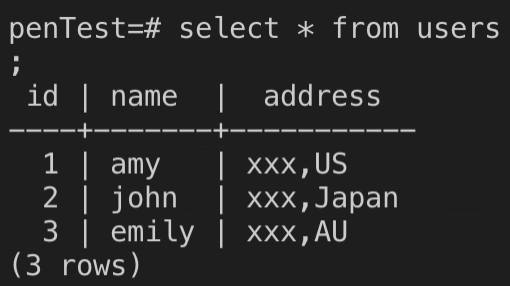

# Azure Functions Penetration Test Pattern

## ZAP not able to detect sql injection (using route params)
1. setup your own postgresdb with a ```users``` table
    - 
2. func host start
3. penetrate function by using
```
    http://localhost:7071/api/user/' or '1'='1' -- 
```
then you will get all user info from db
4. try to attack using OWASP ZAP tool

From above steps you might realize that ZAP does not detect sql injection.

(you see that the + sign (whitespace encoding) is not decoded and causes an syntax error instead of penetrating the function)

the zap report for this is under ```reports/cannot_detect_sql_injection.html```
## ZAP detects sql injection (using params)
you can:
1. remove the ```route``` part in function.json
2. change ```name = req.route_params.get('name')``` to ```name = req.params.get('name')```
3. func host start
4. penetrate function by using 
```
    http://localhost:7071/api/user?name=' or '1'='1' -- 
```
then you will get all user info from db
5. try to attack using OWASP ZAP tool

Then ZAP is able to detect sql injection.

the zap report for this is under ```reports/can_detect_sql_injection.html```


#TODO:
- open api definition (+ api management(optional))
- zap api scan steps
- pipeline