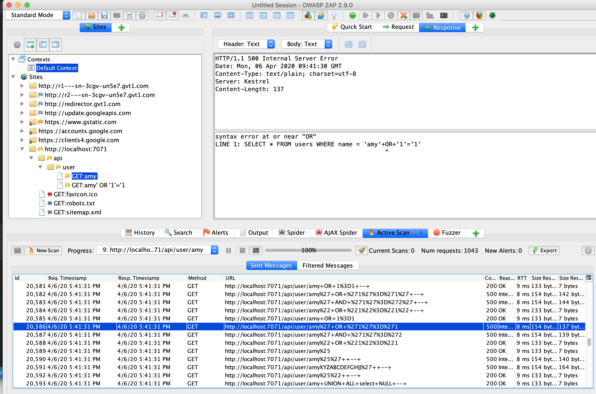

# Azure Functions Penetration Test Pattern

## ZAP detects sql injection (using params)
you can:
1. docker-compose up
2. penetrate function by using 
```
http://localhost:7071/api/user?name=' or '1'='1' -- 
```
then you will get all user info from db

3. try to attack using OWASP ZAP tool
    - ZAP is able to detect sql injection.
    - 
    - the zap report for this is under ```reports/can_detect_sql_injection.html```
4. ```docker-compose down```
## ZAP not able to detect sql injection (using route params)
1. add ```route``` to function.json as below:
```
"bindings": [
    {
      "authLevel": "anonymous",
      "type": "httpTrigger",
      "direction": "in",
      "name": "req",
      "methods": [
        "get"      
      ],
      "route": "user/{name}"
    },
    {
      "type": "http",
      "direction": "out",
      "name": "$return"
    }
  ]
```
2. change ```name = req.params.get('name')``` to ```name = req.route_params.get('name')``` in ```__init__.py```
3. ```docker-compose build```
4. ```docker-compose up```
5. penetrate function by using
```
http://localhost:7071/api/user/' or '1'='1' -- 
```
then you will get all user info from db

6. try to attack using OWASP ZAP tool
    - From above steps you might realize that ZAP does not detect sql injection.
    - 
    - (you see that the + sign (whitespace encoding) is not decoded and causes an syntax error instead of penetrating the function)
    - the zap report for this is under ```reports/cannot_detect_sql_injection.html```
6. ```docker-compose down```

#TODO:
- open api definition (+ api management(optional))
- zap api scan steps
- pipeline